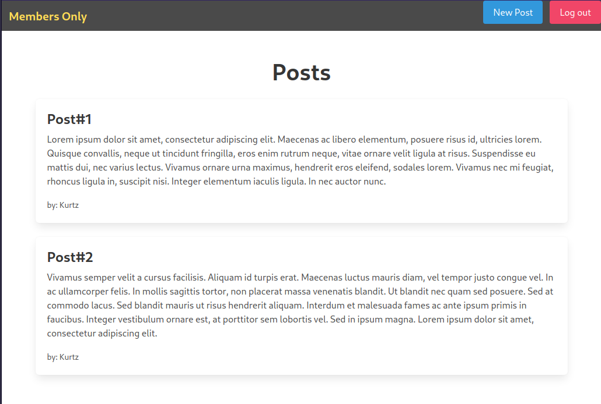

# Devise Authentication with Rails

> Simple website built with Rails using the devise gem to provide Authentication functionality



## Built With

- Ruby 3
- Ruby on Rails 6
- Devise


## Getting Started

To get a local copy up and running follow these simple example steps.

### Prerequisites

- Ruby on Rails v 6.x. For more information on how to install Ruby on Rails, please follow this [link](https://guides.rubyonrails.org/getting_started.html)

### Setup and Install

- Clone this repository using the link above (click on the 'code' button)
- Open a terminal and `cd` to the cloned repository
- Run `bundle install` to install required the dependencies
- Run `bin/rails db:migrate` to migrate the database

### Usage

- Run `bin/rails server` to start the server
- Enter output address from your terminal on your browser to access the page, for instance:
```terminal
 Listening on http://127.0.0.1:3000
```


## Authors

👤 **Gustavo Carvalho**

- GitHub: [@gscarv13](https://github.com/gscarv13)
- Twitter: [@Gscarv13](https://twitter.com/Gscarv13)
- LinkedIn: [Gustavo Carvalho](www.linkedin.com/in/gscarv13)

## 🤝 Contributing

Contributions, issues, and feature requests are welcome!

Feel free to check the [issues page](https://github.com/gscarv13/members-only/issues).

## Show your support

Give a ⭐️ if you like this project!

## 📝 License

This project is [MIT](LICENSE) licensed.